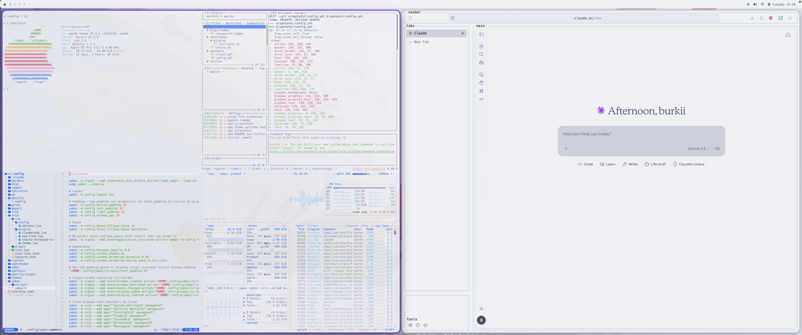
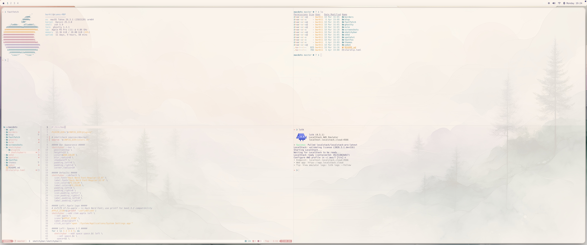

# macdots

My macOS dotfiles

### catppuccin latte

### nord

### rose pine dawn

## Contents

| Tool | Purpose |
|------|---------|
| [yabai](https://github.com/koekeishiya/yabai) | Tiling window manager  |
| [skhd](https://github.com/koekeishiya/skhd) | Hotkeys |
| [sketchybar](https://github.com/FelixKratz/SketchyBar) | Custom menu bar |
| [ghostty](https://ghostty.org) | Terminal |
| [nvim](https://neovim.io) | Neovim (LazyVim) |
| [spotatui](https://github.com/spotUI/spotatui) | Spotify TUI |
| [fastfetch](https://github.com/fastfetch-cli/fastfetch) | Ricing requirement|
| [starship](https://starship.rs) | Shell prompt |
| [borders](https://github.com/FelixKratz/JankyBorders) | Window borders |
| [textfox](https://github.com/adriankarlen/textfox) | Firefox theme |

## Setup

Clone the repo and place the files in ~/.config

### Note

[stylus](https://github.com/openstyles/stylus) is used alongside textfox to apply catppuccin latte styling to websites.

1. install the stylus extension for chrome/firefox
2. Open stylus → manage
3. Click **restore** and select `textfox/import.json` from this repo
