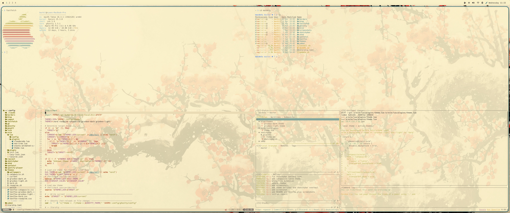
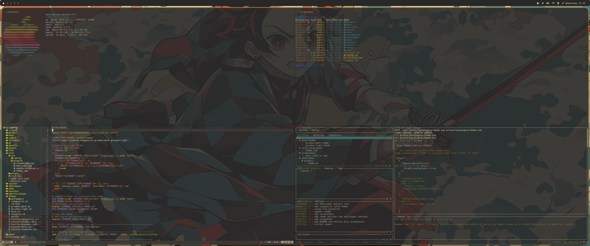

# macdots

My macOS dotfiles

### catppuccin latte


### nord


### rose pine dawn


### gruvbox light



### gruvbox dark



## Contents

| Tool | Purpose |
|------|---------|
| [yabai](https://github.com/koekeishiya/yabai) | Tiling window manager  |
| [skhd](https://github.com/koekeishiya/skhd) | Hotkeys |
| [sketchybar](https://github.com/FelixKratz/SketchyBar) | Custom menu bar |
| [ghostty](https://ghostty.org) | Terminal |
| [nvim](https://neovim.io) | Neovim (LazyVim) |
| [spotatui](https://github.com/spotUI/spotatui) | Spotify TUI |
| [fastfetch](https://github.com/fastfetch-cli/fastfetch) | Ricing requirement|
| [starship](https://starship.rs) | Shell prompt |
| [borders](https://github.com/FelixKratz/JankyBorders) | Window borders |
| [textfox](https://github.com/adriankarlen/textfox) | Firefox theme |

## Theme switcher

Five themes available: `nord`, `rosepine`, `catppuccin`, `gruvbox-dark`, `gruvbox-light`.

Click the paint brush icon in the menu bar to open a dropdown. The active theme is marked with a checkmark. Switching updates Ghostty, sketchybar, borders, starship, wallpaper, btop, textfox, spotatui, and neovim (requires restart).

To add a new theme, create `themes/{name}.sh` with the required color variables, a matching `themes/textfox-{name}.css`, a btop theme at `btop/themes/{name}.theme`, and a wallpaper at `themes/wallpapers/{name}.{png,jpg}`. Then add the name to the `THEMES` array in `themes/switch`.

## Setup

```bash
git clone https://github.com/ryanburkii/macdots.git ~/macdots
cd ~/macdots
./install.sh
```

`install.sh` will:

- Install Homebrew if missing
- Install all dependencies via `brew` (yabai, skhd, sketchybar, borders, btop, starship, fastfetch, neovim, ghostty)
- Symlink each config directory into `~/.config` (existing dirs are backed up with a `.bak` suffix)
- Set executable permissions on all scripts
- Configure textfox if a `*.textfox` Firefox profile exists
- Start yabai, skhd, sketchybar, and borders services
- Apply the nord theme as the default

After install, log out and back in if yabai or skhd need accessibility permissions.

## Updating

```bash
cd ~/macdots
./update.sh
```

`update.sh` will pull the latest changes, fix permissions on any new scripts, re-sync the textfox CSS for the active theme, and re-apply the current theme to pick up any changed color variables or sketchybar config.

## Notes

[stylus](https://github.com/openstyles/stylus) is used alongside textfox to apply catppuccin latte styling to websites.

1. Install the stylus extension for Chrome/Firefox
2. Open Stylus → manage
3. Click **Restore** and select `textfox/import.json` from this repo
